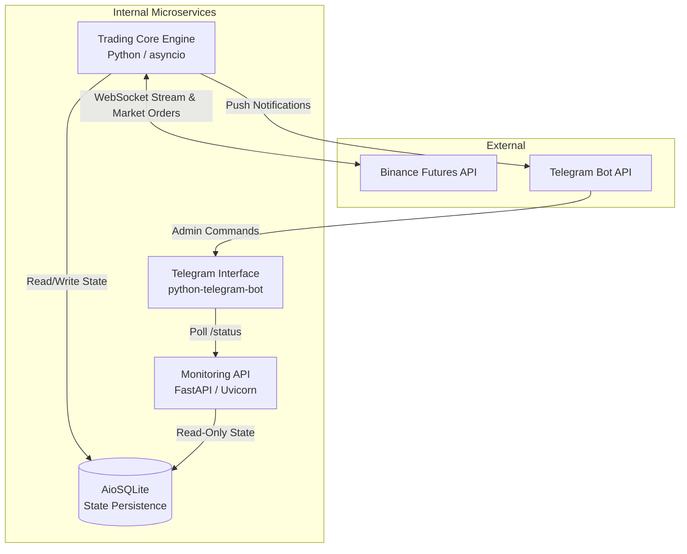

# Cripto Trading Bot: Distributed Algorithmic Trading Architecture

## Overview
This repository contains a high-performance, microservices-based automated trading system designed specifically for the cryptocurrency futures market (Binance). Transitioning from isolated research scripts to a production-ready application, the system leverages concurrent asynchronous programming, walk-forward optimization (WFO), and real-time market execution to manage capital autonomously.

The architecture is strictly modular, separating the trading engine, local data persistence, health monitoring, and external alerting systems into independent components. This ensures fault tolerance, low latency, and ease of scalability for remote deployment on Virtual Private Servers (VPS).

## System Architecture

The ecosystem relies on three primary microservices communicating asynchronously via a unified persistence layer.



### 1. Trading Core Engine (`scripts/bot_live_bidirectional.py`)
The main daemon responsible for market analysis and execution.
*   **WebSockets Integration:** Maintains a persistent WebSocket connection to the exchange to consume real-time Tick/Kline data.
*   **Bidirectional Grid Strategy:** Implements advanced grid methodologies capable of capturing both long and short market movements concurrently.
*   **Execution Modes:** Selectable via the `EXECUTION_MODE` environment variable — `paper` (default, simulated fills on public mainnet data) or `testnet` (real demo orders on Binance Testnet). See [Execution Modes](#execution-modes).
*   **Margin Caps:** Margin per trade is capped at 35% of the current balance (`MAX_MARGIN_PER_TRADE_PCT = 0.35`) and total margin across all open positions is capped at 80% (`MAX_TOTAL_MARGIN_PCT = 0.80`), bounding aggregate exposure regardless of WFO risk output.
*   **Anti-Churn Re-entry:** After a position is closed, the bot does not re-enter the same (symbol, direction) until the next 15m candle opens, preventing immediate re-entry churn on the same grid level.
*   **Anti-Fee Filter:** Entries are only opened when the take-profit distance covers at least ~3× the round-trip fee (0.24%); the same filter is applied inside the WFO simulator so it never optimizes for trades the live engine would reject. The WFO search space is bounded (`tp_mult ∈ [1.0, 2.0]`, `sl_mult ∈ [1.0, 2.5]`, minimum 10 trades guardrail) to stop the optimizer from exploiting fee-dominated, high-win-rate parameter corners.
*   **Dynamic Risk Governor:** Rolling expectancy over the last 30 real trades scales `risk_pct` down (×0.5 on negative expectancy, ×0.25 when the window's net loss reaches 5% of balance). It only brakes — Kelly criterion on live stats does not justify amplifying risk.
*   **Intelligent Exit Manager (`core/exit_manager.py`):** Once a position's peak profit reaches 50% of the way to its take-profit, the stop moves to break-even + fees and then trails, locking in at least 50% of the peak (`TRAILING/BE STOP`). A momentum guard closes profitable trades when price crosses against the EMA20, banking a smaller win instead of giving it back. Per-position `peak_price` is tracked and persisted. Validated on a 5-day replay: +333 USDT vs +131 USDT with classic exits (same entries, same sizing).
*   **Dynamic Optimization (WFO):** Re-runs Walk-Forward Optimization via `optuna` (200 trials, `TPESampler(seed=42)`) and `pandas-ta` on every new 15m candle — a rolling re-optimization over the last 288 candles — to keep take-profit, stop-loss, and grid spacing parameters aligned with recent market volatility.
*   **CCXT Execution Module:** Interfaces directly with Binance Testnet/Mainnet via `core/order_executor.py` to dispatch precision Market Orders, handling automatic leverage configuration and Reduce-Only parameters to mitigate execution risk.

### 2. Monitoring API Server (`api/server.py`)
A lightweight, asynchronous HTTP server built with FastAPI and Uvicorn.
*   Acts as an abstraction layer over the SQLite database.
*   Provides RESTful endpoints allowing external services or custom dashboards to poll the system's operational health, current balance, and active positions without creating race conditions with the Core Engine.

### 3. Notification & Control Interface (`telegram_service.py`)
A dedicated daemon for remote monitoring and control via Telegram.
*   Responds to admin commands: `/start`, `/status`, `/posiciones` and `/portafolio`, querying the FastAPI server on demand for state, open positions and portfolio balance.
*   Runs a background **watchdog** that monitors the freshness of the trading-core state and alerts the admin if the core engine goes down or stops updating.
*   Push alerts for order opens/closes and errors are **not** sent by this service; they are emitted directly by the trading-core engine (`scripts/bot_live_bidirectional.py`).
*   Features a strict Role-Based Access Control (RBAC) mechanism bound to a specific environment-defined `TELEGRAM_ID` to prevent unauthorized access.

### 4. Persistence Layer (`data/trading_bot.db`)
Powered by AioSQLite, ensuring thread-safe, non-blocking disk I/O. Persists the bot's state across restarts, retaining transactional history, active position states, and timestamped optimization metrics.

## Project Structure

```text
.
├── api/
│   └── server.py                  # FastAPI application for state monitoring
├── core/
│   ├── database.py                # AioSQLite wrapper and schema definitions
│   ├── data_loader.py             # Historical data ingestion utilities
│   ├── order_executor.py          # CCXT integration and trade execution logic
│   └── websocket_streamer.py      # Async WebSocket client for Binance streams
├── scripts/
│   ├── bot_live_bidirectional.py  # Main trading loop and strategy implementation
│   ├── backtest_last_24h.py       # Backtest of the strategy over the last 24h
│   └── generate_24h_report.py     # 24h performance report generator
├── tests/
│   ├── test_data_loader.py        # Unit tests for the exchange data loader (mocked)
│   ├── test_websocket_streamer.py # Unit tests for the bookTicker streamer & reconnect backoff
│   └── test_paper_mode.py         # Unit tests for paper-mode executor logic (PnL, defaults, margin caps)
├── telegram_service.py            # Telegram bot interface daemon (commands + watchdog)
├── ecosystem.config.js            # PM2 process definitions (production deployment)
├── run_bot_247.bat                # LEGACY launcher (deprecated, use PM2 instead)
├── requirements.txt               # Dependency lockfile
├── .env.example                   # Environment configuration template
└── README.md
```

## API Documentation

The FastAPI service exposes the following endpoints for monitoring purposes.

### `GET /status`
Returns the current operational state of the trading bot.

**Response:**
```json
{
  "status": "running (PAPER)",
  "balance": 5000.0,
  "positions": {
    "BTC/USDT": {
      "LONG": {
        "entry_price": 64000.5,
        "size_usd": 1000.0,
        "amount": 0.0156,
        "open_time": 1721021400.0
      }
    }
  },
  "last_wfo_time": "2026-07-19 08:45 UTC"
}
```

## Prerequisites

*   Python 3.10 or higher.
*   A stable internet connection capable of maintaining WebSocket streams.
*   Valid Binance Testnet API credentials — only required when running with `EXECUTION_MODE=testnet` (PAPER mode needs no keys).
*   A Telegram Bot Token (obtained via BotFather).

## Installation and Setup

1.  **Clone the repository:**
    ```bash
    git clone https://github.com/your-repo/cripto-trading-bot.git
    cd cripto-trading-bot
    ```

2.  **Initialize a virtual environment:**
    ```bash
    python -m venv .entorno
    source .entorno/bin/activate  # On Windows use: .entorno\Scripts\activate
    ```

3.  **Install dependencies:**
    ```bash
    pip install -r requirements.txt
    ```

4.  **Environment Configuration:**
    Create a `.env` file in the root directory. The system strictly reads from this file to ensure credentials are never hardcoded or pushed to version control.
    ```env
    # Execution Mode: paper (default, no keys needed) or testnet
    EXECUTION_MODE=paper

    # Exchange Credentials (only required for EXECUTION_MODE=testnet)
    BINANCE_TESTNET_KEY=your_api_key_here
    BINANCE_TESTNET_SECRET=your_api_secret_here

    # Telegram Integration
    TELEGRAM_BOT_API=your_telegram_bot_token
    TELEGRAM_ID=your_personal_chat_id
    ```

## Execution Modes

The trading core supports two execution modes, selected via the `EXECUTION_MODE` environment variable (default: `paper`). Real mainnet trading with actual funds is **not supported yet**.

| | `paper` (default) | `testnet` |
|---|---|---|
| **Data source** | Public mainnet data (OHLCV + WebSocket) | Binance Testnet (consistent venue: testnet WS) |
| **Fills** | Simulated at current price (mid) | Real demo orders on Binance Testnet |
| **API keys required** | None | `BINANCE_TESTNET_KEY` / `BINANCE_TESTNET_SECRET` |
| **Balance & accounting** | Local state, 0.08% round-trip fee | Testnet account balance |
| **When to use it** | Validation against the 24h live backtest (exact replica of its environment) | Exchange integration testing (order signing, reduce-only, leverage) |

*   **PAPER mode** is an exact replica of the 24h live backtest environment (`scripts/backtest_last_24h.py`): it consumes public mainnet market data, simulates fills at the current price and keeps all accounting locally (balance from local state, 0.08% round-trip fee). No Binance API keys are required, since no order ever reaches the exchange. Use it to verify that live behavior matches the backtest before involving any exchange venue.
*   **TESTNET mode** executes real demo orders against Binance Testnet, keeping the venue consistent (testnet WebSocket for market data). Use it to validate the full exchange integration — order dispatch, reduce-only handling, leverage configuration — without risking capital.

Telegram notifications and the status persisted for the API reflect the active mode: `NUEVA POSICIÓN (PAPER)` / `POSICIÓN CERRADA (PAPER)` messages, and a `running (PAPER)` or `running (TESTNET)` status field.

## Execution Workflow (Production Deployment)

For a production environment (e.g., Linux VPS), it is highly recommended to run the services using process managers like `systemd` or terminal multiplexers like `tmux`.

### Standard Execution
Start the services in the following order across separate terminal sessions:

1.  **Initialize the API Server:**
    ```bash
    python -m uvicorn api.server:app --host 127.0.0.1 --port 8000
    ```

2.  **Initialize the Telegram Service:**
    ```bash
    python telegram_service.py
    ```

3.  **Launch the Trading Engine:**
    ```bash
    python scripts/bot_live_bidirectional.py
    ```

### PM2 Deployment on Windows (Recommended)
On Windows, the supported way to run the full stack is [PM2](https://pm2.keymetrics.io/), which keeps the three services alive, restarts them with exponential backoff and captures their logs.

```bash
npm install -g pm2
pm2 start ecosystem.config.js
pm2 save
```

This launches the three apps defined in `ecosystem.config.js` (`api-server`, `trading-core`, `telegram-bot`) with `cwd` pinned to the repository root, so relative paths work regardless of where PM2 is invoked from. Useful commands:

```bash
pm2 status            # overview of the three services
pm2 logs trading-core # follow live logs
pm2 restart all       # restart every service
```

> **Note:** `run_bot_247.bat` is a **legacy** launcher kept only for reference. Do not use it alongside PM2: the bot enforces a single-instance lock via socket, so a second start would simply fail and the `.bat` loop would retry forever.

### Systemd Deployment Example
To ensure maximum uptime, you can configure systemd services for each component. Example for the API server (`/etc/systemd/system/tradingbot-api.service`):

```ini
[Unit]
Description=Cripto Trading Bot API Service
After=network.target

[Service]
User=deploy
WorkingDirectory=/opt/cripto-trading-bot
Environment="PATH=/opt/cripto-trading-bot/.entorno/bin"
ExecStart=/opt/cripto-trading-bot/.entorno/bin/python -m uvicorn api.server:app --host 127.0.0.1 --port 8000
Restart=always

[Install]
WantedBy=multi-user.target
```

## Monitoring and Logging

The system features robust file-based logging utilizing Python's native `logging` module with `RotatingFileHandler`. 
*   **Log Location:** `bot_live.log`
*   **Rotation Policy:** Logs are capped at 5MB per file, maintaining a history of up to 5 files (5MB × 5) with UTF-8 encoding to prevent disk exhaustion on long-running instances.
*   **Verbosity:** Captures INFO level operational metrics and ERROR level stack traces for seamless debugging.

## Security Considerations

*   **API Keys:** Ensure your Binance API keys are restricted strictly to Futures Trading and Reading. Never enable Withdrawal permissions.
*   **Telegram Authorization:** The Telegram wrapper uses hardcoded environment validation. If a user attempts to interact with the bot whose Chat ID does not explicitly match the `TELEGRAM_ID` environment variable, the system silently drops the request and logs a security exception. This prevents malicious actors from extracting state data or issuing unauthorized commands.
*   **Local API Bound:** The FastAPI server binds strictly to `127.0.0.1` by default, ensuring the endpoints cannot be queried remotely without establishing an SSH tunnel or a reverse proxy with proper authentication.

## Diferencias conocidas backtest vs live (modo paper)

Los resultados de los backtests (`scripts/backtest_last_24h.py`, `scripts/generate_24h_report.py`) no son directamente comparables con el modo PAPER en vivo por estas diferencias conocidas:

*   **Fills simulados al mid vs límite exacto en el nivel:** en modo paper las órdenes se simulan al precio actual (mid) en el momento en que el mercado toca el nivel, mientras que el simulador asume fills exactos al precio límite calculado para ese nivel del grid.
*   **Leverage 3x vs apalancamiento implícito del sim:** el bot opera con apalancamiento fijo 3x (`BOT_LEVERAGE`, default 3); el simulador usa un apalancamiento implícito derivado del tamaño de posición asumido, que no replica el margen real.
*   **Fee 0.08% round-trip en ambos:** tanto el backtest como el modo paper aplican la misma comisión del 0.08% round-trip (`pnl_usdt = size * (pnl_pct - 0.0008)`), por lo que las comisiones ya no son una fuente de divergencia entre ambos entornos.

## Disclaimer

This software is for educational and research purposes only. Do not risk money which you are afraid to lose. USE THE SOFTWARE AT YOUR OWN RISK. THE AUTHORS AND ALL AFFILIATES ASSUME NO RESPONSIBILITY FOR YOUR TRADING RESULTS.
