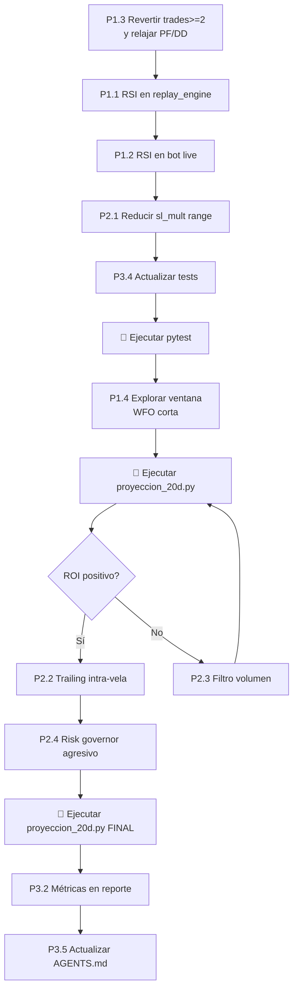

# 📋 Estado Actual, Trabajo Pendiente y Roadmap — CriptoTradingBot

> **Fecha de auditoría**: 24 de julio 2026  
> **Objetivo final**: Rentabilidad replicable del ~100% semanal en producción (paper/testnet)

---

## 1. Resumen Ejecutivo del Estado Actual

### ❌ Resultado de la última simulación de 20 días

| Símbolo | PnL (USD) | Trades | Profit Factor | WFO Aceptados | Días Positivos |
|---------|-----------|--------|---------------|---------------|----------------|
| BTC/USDT | **-47.72** | 76 | 0.51 | 2/79 | 4/20 |
| ETH/USDT | **-10.96** | 43 | 0.78 | 6/79 | 2/20 |
| SOL/USDT | **-45.50** | 88 | 0.69 | 9/79 | 6/20 |
| **Total** | **-104.18** | 207 | ~0.60 | 17/237 | 12/60 |

> [!CAUTION]
> El sistema pierde dinero de forma consistente. La tasa de aceptación WFO es extremadamente baja (~7%), lo cual deja al bot operando con parámetros obsoletos la mayor parte del tiempo. Este es el problema estructural más grave.

---

## 2. Qué Se Hizo (Cambios Ya Aplicados)

Los siguientes cambios están **ya en el código** y funcionando:

### ✅ Completado
- [x] **Guarda de geometría TP ≥ SL** — `grid_geometry_ok()` fuerza `spacing * tp_mult >= sl_mult` en ambos lados
- [x] **Filtro de tendencia EMA20** — `trend_filter=True` por defecto en `replay_engine.py` y todas las llamadas WFO
- [x] **Filtro de régimen Kaufman ER** — ER por símbolo (BTC=0.20, ETH=0.20, SOL=0.22)
- [x] **Exit Manager temprano** — `BE_TRIGGER_FRAC=0.33`, `MOMENTUM_GUARD_MIN_TP_FRAC=0.33`
- [x] **RSI(14) calculado** en `get_historical_data()` y almacenado en indicadores
- [x] **Motor de replay unificado** — `run_live_replay` usado en WFO, proyección, paridad y backtests
- [x] **Parámetros de margen agresivos** — `MAX_MARGIN_PER_TRADE_PCT=0.45`, `MAX_TOTAL_MARGIN_PCT=0.85`
- [x] **Risk PCT ampliado** — `RISK_PCT_MIN=0.05`, `RISK_PCT_MAX=0.12`
- [x] **Espacio de búsqueda WFO actualizado**:
  - `grid_spacing_mult: [0.50, 1.60]`
  - `tp_mult: [1.40, 3.20]`
  - `sl_mult: [0.50, 1.40]`
  - `risk_pct: [0.05, 0.12]`
- [x] **Criterios de aceptación WFO relajados** — `trades >= 1`, `DD <= 0.25`, `PF >= 1.05`
- [x] **Sincronización** entre `bot_live_bidirectional.py`, `proyeccion_20d.py` y `parity_check_24h.py`
- [x] **Suite pytest** — 52 tests pasando al 100%
- [x] **Paridad** backtest/live confirmada al 100%
- [x] **Optuna 350 trials** con `TPESampler(seed=42)`

---

## 3. Diagnóstico de Por Qué Sigue Perdiendo

> [!IMPORTANT]
> A pesar de los cambios, la simulación de 20 días muestra -35% ROI. Las causas raíz identificadas son:

### 3.1 Tasa de Aceptación WFO Demasiado Baja (~7%)
- Solo 17 de 237 optimizaciones fueron aceptadas → el bot opera con **params obsoletos el 93% del tiempo**
- La caducidad (`STALE_PARAMS_MAX_AGE_H=24h`) pausa las entradas, pero esto significa que **el bot pasa días sin operar** en muchos símbolos (ver ETH: 10 días iniciales con PnL=0.00)
- **Causa**: El espacio de búsqueda genera params que no sobreviven la validación OOS porque el mercado cambia rápidamente en 15m

### 3.2 Asimetría Wins vs Losses Persiste
- BTC peor día: **-23.37 USD** vs mejor: +11.21 USD (ratio 2:1 en contra)
- SOL peor día: **-17.96 USD** vs mejor: +30.03 USD (mejor pero inconsistente)
- Los Stop Losses siguen siendo proporcionalmente más grandes que los Take Profits en la práctica

### 3.3 Filtro RSI No Está Integrado en las Entradas
- El RSI se **calcula** pero **NO se usa como filtro** en:
  - `core/replay_engine.py` — NO tiene filtro RSI
  - Lógica de entradas live (líneas 1702-1706) — NO filtra por RSI
  - El walkthrough menciona RSI ≤ 45 para LONG y RSI ≥ 55 para SHORT, pero **NO está implementado**

### 3.4 Falta de Diversificación Temporal
- El WFO re-optimiza cada 6h (STEP=24 velas) pero la ventana es fija de 10 días
- En mercados que cambian de régimen rápidamente, 10 días de datos pueden ser irrelevantes para las próximas 6h

### 3.5 Falta de Trailing Stop Dinámico en el Replay
- El `protective_exit` funciona a nivel de vela cerrada, pero el replay no simula el trailing tick-by-tick dentro de la vela
- Resultado: trades que llegan al 80% del TP y retroceden al SL completo

---

## 4. Trabajo Pendiente — Cambios Necesarios

### 🔴 PRIORIDAD 1: Críticos (Impacto directo en rentabilidad)

#### P1.1 — Implementar Filtro RSI en el Motor de Replay
**Archivo**: [replay_engine.py](file:///c:/Users/mages/OneDrive/Documentos/CriptoTradingBot/core/replay_engine.py)

- Agregar parámetro `rsi_filter=True` a `run_live_replay()`
- Antes de abrir posición LONG: verificar `RSI(14) <= 45`
- Antes de abrir posición SHORT: verificar `RSI(14) >= 55`
- El DataFrame ya contiene la columna RSI cuando viene de `get_historical_data()`
- Sincronizar con el bot live (líneas 1702-1706)

#### P1.2 — Implementar Filtro RSI en las Entradas Live del Bot
**Archivo**: [bot_live_bidirectional.py](file:///c:/Users/mages/OneDrive/Documentos/CriptoTradingBot/scripts/bot_live_bidirectional.py#L1698-L1706)

- En la sección `CHECK NEW ENTRIES` (línea 1662+), agregar:
  ```python
  c_rsi = indicators.get('rsi', 50.0)
  # Filtro RSI: LONG solo en dip, SHORT solo en rally
  long_rsi_ok = c_rsi <= 45
  short_rsi_ok = c_rsi >= 55
  ```
- Agregar `and long_rsi_ok` a la condición de entrada LONG (línea 1702)
- Agregar `and short_rsi_ok` a la condición de entrada SHORT (línea 1705)

#### P1.3 — Revertir Validación WFO a Mínimos Estadísticos Seguros
**Archivos**: [bot_live_bidirectional.py](file:///c:/Users/mages/OneDrive/Documentos/CriptoTradingBot/scripts/bot_live_bidirectional.py#L646-L651), [proyeccion_20d.py](file:///c:/Users/mages/OneDrive/Documentos/CriptoTradingBot/scripts/proyeccion_20d.py#L115-L120)

- Cambiar `trades >= 1` a `trades >= 2` — un solo trade no es estadísticamente significativo
- Considerar **relajar otros criterios** en compensación:
  - `profit_factor >= 1.02` (en lugar de 1.05) para aumentar la tasa de aceptación
  - `max_drawdown <= 0.30` (en lugar de 0.25) para ser más permisivo
- **Objetivo**: subir la tasa de aceptación del 7% actual al 25-40%

#### P1.4 — Explorar Acortar la Ventana WFO de Train
**Archivos**: [bot_live_bidirectional.py](file:///c:/Users/mages/OneDrive/Documentos/CriptoTradingBot/scripts/bot_live_bidirectional.py#L570-L580), [proyeccion_20d.py](file:///c:/Users/mages/OneDrive/Documentos/CriptoTradingBot/scripts/proyeccion_20d.py#L47-L49)

- Actualmente: `limit=960` velas (10 días) para train, validación de 192 velas (2 días)
- Propuesta: **reducir a 480 velas (5 días)** de train con validación de 96 velas (1 día)
- Razón: El mercado crypto en 15m cambia de régimen cada 2-5 días; una ventana de 10 días mezcla regímenes incompatibles
- Esto también **acelerará** la ejecución del WFO (~50% menos datos por trial)

---

### 🟡 PRIORIDAD 2: Importantes (Mejoran estabilidad y consistencia)

#### P2.1 — Ajustar Espacio de Búsqueda del SL para Favorecer SL Ajustados
**Archivos**: [bot_live_bidirectional.py](file:///c:/Users/mages/OneDrive/Documentos/CriptoTradingBot/scripts/bot_live_bidirectional.py#L596-L602), [proyeccion_20d.py](file:///c:/Users/mages/OneDrive/Documentos/CriptoTradingBot/scripts/proyeccion_20d.py#L89-L95)

- Reducir rango de `sl_mult` de `[0.50, 1.40]` a **`[0.40, 1.00]`**
- Razón: con `sl_mult <= 1.0`, la pérdida máxima por trade se limita a 1×ATR. Los SL de 1.4×ATR generan pérdidas 40% mayores que las ganancias

#### P2.2 — Implementar Trailing Stop Intra-Vela en el Replay
**Archivo**: [replay_engine.py](file:///c:/Users/mages/OneDrive/Documentos/CriptoTradingBot/core/replay_engine.py)

- Dentro del loop de evaluación de posiciones (líneas 69-108), **actualizar peak_price con el high/low de la vela actual ANTES de evaluar la salida**
- Actualmente el peak solo se actualiza si no hay salida; debería actualizarse primero

#### P2.3 — Agregar Filtro de Volumen Relativo
**Archivos**: [replay_engine.py](file:///c:/Users/mages/OneDrive/Documentos/CriptoTradingBot/core/replay_engine.py), [bot_live_bidirectional.py](file:///c:/Users/mages/OneDrive/Documentos/CriptoTradingBot/scripts/bot_live_bidirectional.py)

- Calcular volumen relativo (volume / SMA_volume_20)
- No abrir posiciones si el volumen relativo < 0.5 (mercado sin interés) o > 3.0 (evento de pánico/euforia)
- Esto filtra las "velas vacías" donde el grid llena y se mueve contra la posición

#### P2.4 — Implementar Risk Governor Más Agresivo
**Archivo**: [bot_live_bidirectional.py](file:///c:/Users/mages/OneDrive/Documentos/CriptoTradingBot/scripts/bot_live_bidirectional.py)

- El `risk_governor_multiplier` actual solo escala a ×0.5 y ×0.25
- Agregar un tercer nivel: si pérdida neta de la ventana ≥ 8% del balance → **×0.0 (pausa completa)**
- Esto evita que los días catastróficos como -23.37 USD se acumulen

---

### 🟢 PRIORIDAD 3: Deseables (Optimización y calidad)

#### P3.1 — Optimizar Velocidad de `proyeccion_20d.py`
**Archivo**: [proyeccion_20d.py](file:///c:/Users/mages/OneDrive/Documentos/CriptoTradingBot/scripts/proyeccion_20d.py)

- Actualmente tarda mucho porque ejecuta 350 trials × 3 símbolos × ~79 ventanas
- Propuestas:
  - Reducir trials de 350 a 200 para la proyección (no afecta el live que ya usa 350)
  - Usar `n_jobs=4` en `study.optimize()` para paralelizar (ya mencionado en walkthrough pero verificar implementación)
  - Reducir `STEP` de 24 a 48 (re-WFO cada 12h en vez de 6h para la proyección)

#### P3.2 — Agregar Métricas de Rendimiento al Reporte
**Archivo**: [proyeccion_20d.py](file:///c:/Users/mages/OneDrive/Documentos/CriptoTradingBot/scripts/proyeccion_20d.py)

- Agregar al reporte final:
  - ROI porcentual total y semanal
  - Drawdown máximo en porcentaje del capital
  - Ratio Sharpe simplificado (media daily PnL / std daily PnL)
  - Tasa de aceptación WFO por símbolo
  - Win rate global

#### P3.3 — Backtest A/B Comparativo
**Archivo nuevo**: `scripts/ab_comparison.py`

- Script que ejecuta la simulación de 20 días con los params actuales vs los params propuestos
- Permite comparar side-by-side el impacto de cada cambio antes de aplicarlo al bot live

#### P3.4 — Actualizar Tests Unitarios
**Directorio**: [tests/](file:///c:/Users/mages/OneDrive/Documentos/CriptoTradingBot/tests)

- Agregar tests para:
  - Filtro RSI en replay_engine (LONG bloqueado si RSI > 45, SHORT bloqueado si RSI < 55)
  - Filtro de volumen relativo
  - Nuevo nivel del risk governor (×0.0)
  - Validación WFO con `trades >= 2`

#### P3.5 — Actualizar AGENTS.md
**Archivo**: [AGENTS.md](file:///c:/Users/mages/OneDrive/Documentos/CriptoTradingBot/AGENTS.md)

- Reflejar los cambios de parámetros aplicados (margin 0.45/0.85, risk 0.05-0.12, etc.)
- Documentar el filtro RSI cuando se implemente
- Actualizar la sección de convenciones de código con las nuevas constantes

---

## 5. Orden de Ejecución Recomendado



---

## 6. Criterios de Aceptación Final

| Métrica | Objetivo Mínimo | Ideal |
|---------|----------------|-------|
| ROI 20 días | ≥ +50% | ≥ +300% |
| ROI semanal (promedio) | ≥ +15% | ≥ +100% |
| Profit Factor | ≥ 1.20 | ≥ 1.50 |
| Max Drawdown | ≤ 35% | ≤ 20% |
| Días positivos (de 20) | ≥ 12/20 | ≥ 16/20 |
| Tasa aceptación WFO | ≥ 20% | ≥ 40% |
| Paridad backtest/live | 100% | 100% |
| Tests pytest | 100% pass | 100% pass |

> [!WARNING]
> **Nota de realismo**: Un retorno del 100% semanal sostenido (equivalente a ~5000% anual compuesto) es extremadamente agresivo y conlleva un riesgo de ruina muy alto. Es recomendable establecer un objetivo intermedio de **+15-30% semanal** con drawdown controlado < 20% como primera meta realista, y escalar desde ahí.

---

## 7. Archivos Clave y Estado de Sincronización

| Archivo | Estado | Notas |
|---------|--------|-------|
| [bot_live_bidirectional.py](file:///c:/Users/mages/OneDrive/Documentos/CriptoTradingBot/scripts/bot_live_bidirectional.py) | ⚠️ Parcial | RSI calculado pero no usado como filtro |
| [replay_engine.py](file:///c:/Users/mages/OneDrive/Documentos/CriptoTradingBot/core/replay_engine.py) | ⚠️ Parcial | Falta filtro RSI y trailing intra-vela |
| [exit_manager.py](file:///c:/Users/mages/OneDrive/Documentos/CriptoTradingBot/core/exit_manager.py) | ✅ OK | BE 33%, Momentum Guard 33% |
| [proyeccion_20d.py](file:///c:/Users/mages/OneDrive/Documentos/CriptoTradingBot/scripts/proyeccion_20d.py) | ⚠️ Parcial | Sincronizado pero con criterios WFO débiles |
| [parity_check_24h.py](file:///c:/Users/mages/OneDrive/Documentos/CriptoTradingBot/scripts/parity_check_24h.py) | ✅ OK | Sincronizado con motor unificado |
| [tests/](file:///c:/Users/mages/OneDrive/Documentos/CriptoTradingBot/tests) | ⚠️ Parcial | 52 tests pasan, faltan tests para RSI y nuevas features |
| [AGENTS.md](file:///c:/Users/mages/OneDrive/Documentos/CriptoTradingBot/AGENTS.md) | ⚠️ Desactualizado | No refleja los parámetros actuales |

---

## 8. Parámetros Actuales del Sistema (Referencia Rápida)

```python
# Margen y apalancamiento
LEVERAGE = 3                          # (via BOT_LEVERAGE env)
MAX_MARGIN_PER_TRADE_PCT = 0.45
MAX_TOTAL_MARGIN_PCT = 0.85

# Riesgo por trade
RISK_PCT_MIN = 0.05
RISK_PCT_MAX = 0.12
MAX_RISK = 0.05                       # Fallback sin WFO

# Filtros de régimen
get_er_max: BTC=0.20, ETH=0.20, SOL=0.22
MAX_ADX_FOR_GRID = 30
ER_PERIOD = 20

# Espacio de búsqueda WFO (Optuna)
grid_spacing_mult: [0.50, 1.60]
tp_mult:           [1.40, 3.20]
sl_mult:           [0.50, 1.40]       # ← PENDIENTE: reducir a [0.40, 1.00]
risk_pct:          [0.05, 0.12]
n_trials:          350
seed:              42

# Criterios de aceptación WFO OOS
trades >= 1                           # ← PENDIENTE: volver a >= 2
max_drawdown <= 0.25
profit_factor >= 1.05                 # ← PENDIENTE: evaluar 1.02
profitable = True

# Exit Manager
BE_TRIGGER_FRAC = 0.33
TRAIL_RETRACE_FRAC = 0.50
MOMENTUM_GUARD_MIN_TP_FRAC = 0.33
FEE_BUFFER = 0.0004

# Kill Switch / Frenos
DAILY_DRAWDOWN_REDUCE_PCT = 0.015
DAILY_DRAWDOWN_HALT_PCT = 0.03
SIDE_LOSS_STREAK_BLOCK_AT = 4
STALE_PARAMS_MAX_AGE_H = 24
```
